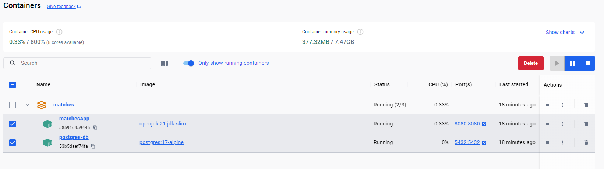
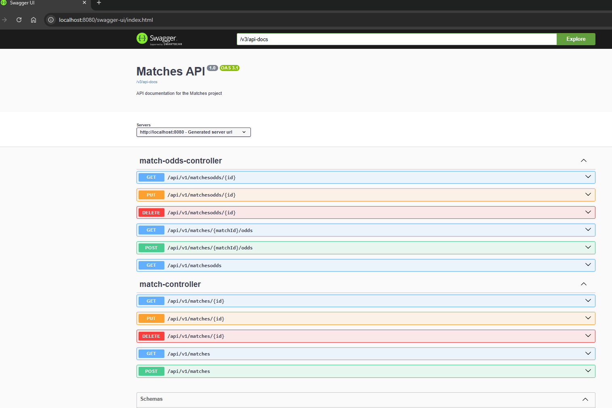
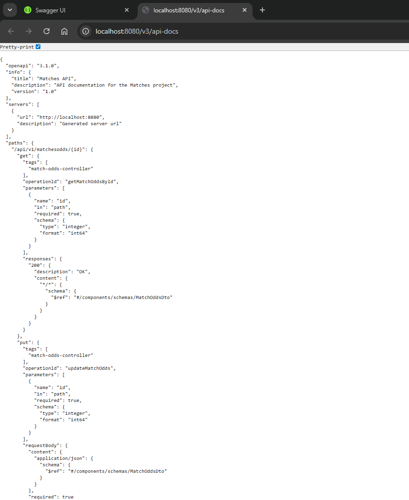
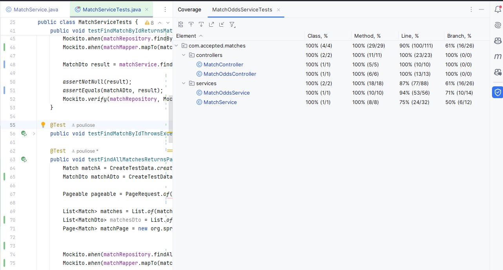

# Matches SpringBoot Application

## Overview
This project is a Spring Boot application that manages matches and their odds. It includes two main entities:
1. **Match**: Represents a sports match with details like date, time, teams, and sport type.
2. **MatchOdds**: Represents the betting odds for a match, including specifier and odd value.

## Technologies Used
- **Java 21**: Programming language.
- **Spring Boot**: Framework for building the application.
- **Maven**: Build and dependency management tool.
- **PostgreSQL**: Database for storing match and odds data.
- **Docker**: Containerization platform for running the application and database.
- **Lombok**: Reduces boilerplate code for Java classes.
- **Springdoc OpenAPI Starter WebMVC UI**: For generating OpenAPI documentation and providing a Swagger UI.


## Prerequisites
- Docker and Docker Compose installed on your system.
- Maven installed for building the application.

## How to Run the Application with Docker
1. **Build the Application**:
    - Run the following command to package the application into a JAR file:
      ```bash
      mvn clean package
      ```
    - The JAR file will be generated in the `target` directory.

2. **Set Up Docker**:
    - Ensure the `docker-compose.yml` file and `Dockerfile` are present in the project root.

3. **Run Docker Compose**:
    - Start the application and database using Docker Compose:
      ```bash
      docker-compose up --build
      ```
    - This will:
        - Start a PostgreSQL database container.
        - Start the Spring Boot application container.

4. **Access the Application**:
    - The application will be available at `http://localhost:8080`.
    - The Swagger UI for API documentation can be accessed at `http://localhost:8080/swagger-ui/index.html`. Raw OpenAPI JSON: Available at http://localhost:8080/v3/api-docs

5. **Stop the Application**:
    - To stop the containers, run:
      ```bash
      docker-compose down
      ```

## Database Configuration
The application connects to a PostgreSQL database using the following default configuration:
- **Database Name**: `matches_db`
- **Username**: `username`
- **Password**: `password`

These values can be modified in the `docker-compose.yml` file.

## Entities
### Match
- **Fields**:
    - `id`: Primary key (auto-generated).
    - `description`: Description of the match.
    - `matchDate`: Date of the match.
    - `matchTime`: Time of the match.
    - `teamA`: Name of team A.
    - `teamB`: Name of team B.
    - `sport`: Type of sport (e.g., FOOTBALL, BASKETBALL).

### MatchOdds
- **Fields**:
    - `id`: Primary key (auto-generated).
    - `matchId`: ID of the associated match.
    - `specifier`: Enum value representing "1", "X", or "2".
    - `odd`: Betting odd value.

## Notes
- Ensure the database service (`db`) is running before the application starts.
- Use the logs to debug any issues:
  ```bash
  docker logs springboot-app
  docker logs postgres-db
    ```
## Additional Resources

### Images and Documentation
The following resources are available in the project:

1. **Docker Containers**:  
   

2. **Swagger UI**:  
   
   

3. **Test Results**:  
   
4. Postman collection

## Assumptions
- In entity MatchOdds the field `specifier` is an enum that can take values "1", "X", or "2".
- The id fields in the two entities are not updatable through the API.

## Improvements
- Add more validation steps for incoming requests eg. matchDate and matchTime should not be in the past. The matchOdds specifier should be one of the allowed values and do not allow double specifier per match.
- Create DTOs (Data Transfer Objects) for Match and MatchOdds per Http verb, different for CreateMatchRequest, UpdateMatchRequest.
- Add more API endpoints eg to get all matches for a specific sport.
- Add more tests about more complicated scenarios, better null checks.